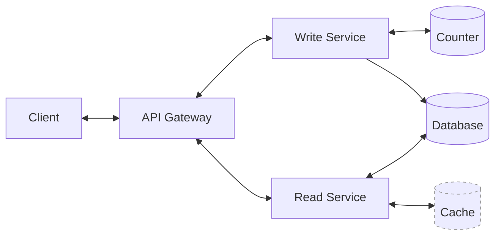
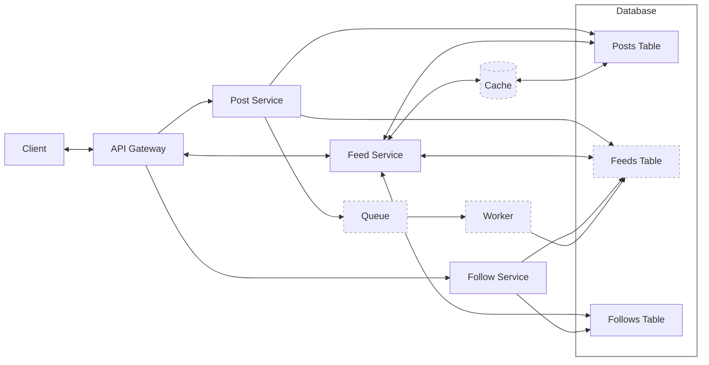
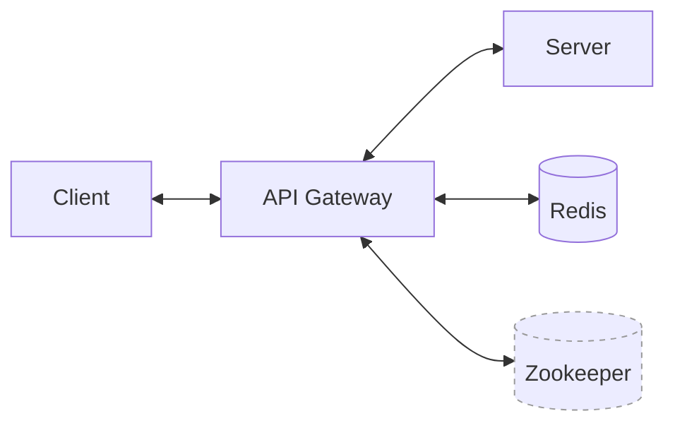
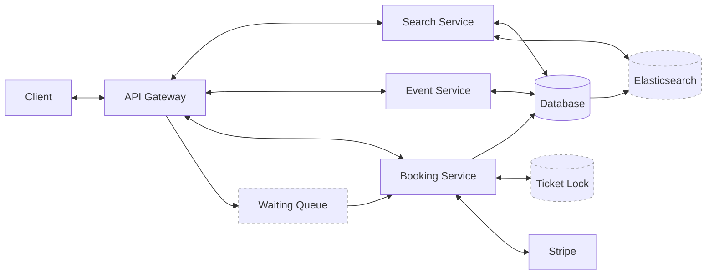
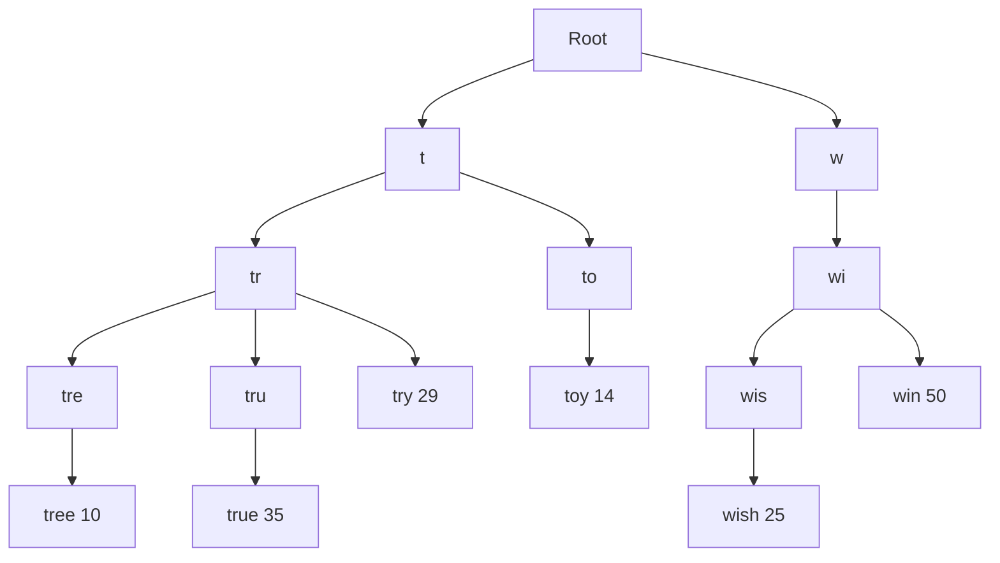
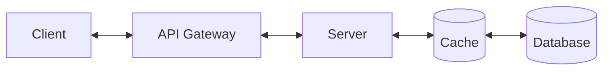
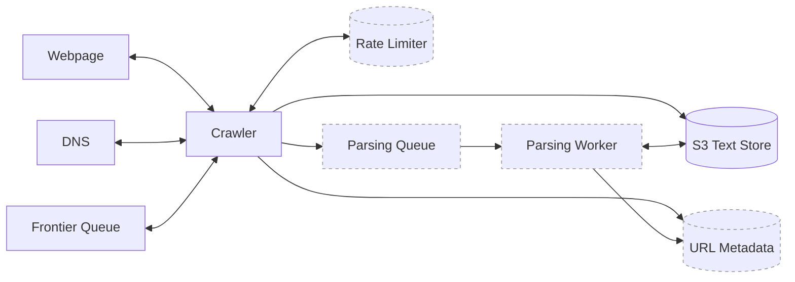
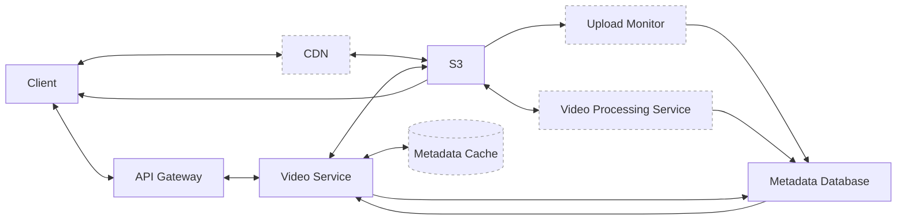

<section class="relative mb-4 sm:mb-8 break-inside-avoid-column overflow-hidden rounded-md bg-zinc-950/5 p-4 dark:bg-white/5" markdown="1">

{% svg /assets/images/streamline/neural-network.svg width="100%" height="100%" %}

# System Design

This cheatsheet attempts to give a high-level overview of system design principles and patterns. Please [contact me](https://twitter.com/tlyleung) for corrections/omissions.

_Last updated: 1 January 2026_

</section>

<section class="relative mb-4 sm:mb-8 break-inside-avoid-column overflow-hidden rounded-md bg-zinc-950/5 p-4 dark:bg-white/5" markdown="1">

{% svg /assets/images/streamline/book-flip-page.svg width="100%" height="100%" %}

# Contents

- [Problem Solving](#problem-solving)
- [Concepts](#concepts)
  - [API Design](#concepts-api-design)
  - [Caching](#concepts-caching)
  - [Databases](#concepts-databases)
  - [Load Balancing](#concepts-load-balancing)
  - [Message Queues](#concepts-message-queues)
  - [Networking](#concepts-networking)
  - [Numbers](#concepts-numbers)
- [Designs](#designs)
  - [Link Shortener](#designs-link-shortener)
  - [News Feed](#designs-news-feed)
  - [Rate Limiter](#designs-rate-limiter)
  - [Ticketmaster](#designs-ticketmaster)
  - [Typeahead](#designs-typeahead)
  - [Unique ID Generator](#designs-unique-id-generator)
  - [Web Crawler](#designs-web-crawler)
  - [YouTube](#designs-youtube)

</section>

<section class="relative mb-4 sm:mb-8 break-inside-avoid-column overflow-hidden rounded-md bg-zinc-950/5 p-4 dark:bg-white/5" markdown="1">

{% svg /assets/images/streamline/bulb-1.svg width="100%" height="100%" %}

# Problem Solving[^grok22][^hello24]

1. **Requirements**
   - **Functional:** these are your "users can..." statements and the core features of the system.
   - **Non-functional:** these are your "the system should be..." statements and the system qualities important to users.
2. **Core Entities:** list the core entities that the API will interact with and that the system will persist.
3. **API:** define the contract between the system and its users, including which API protocol to use, e.g REST, GraphQL, RPC, etc.
4. **Data Flow:** describe the sequence of actions the system performs on the inputs to produce the outputs.
5. **Architecture:** draw boxes and arrows to represent the system's components and their interactions.
6. **Challenges:** harden the design by ensuring it: (i) meets all the non-functional requirements; (ii) addresses edge cases; (iii) addresses bottlenecks; and (iv) builds on hints from the interviewer.
</section>

<section class="relative mb-4 sm:mb-8 break-inside-avoid-column overflow-hidden rounded-md bg-zinc-950/5 p-4 dark:bg-white/5" markdown="1">

{% svg /assets/images/streamline/educative-toys-maths.svg width="100%" height="100%" %}

# Concepts

Useful concepts to consider when designing scalable systems.

</section>

<section class="relative mb-4 sm:mb-8 break-inside-avoid-column overflow-hidden rounded-md bg-zinc-950/5 p-4 dark:bg-white/5" markdown="1">

{% svg /assets/images/streamline/cog-double-3.svg width="100%" height="100%" %}

# Concepts: API Design[^hello24][^interviewing22]

APIs describe how clients and services communicate.

There are three common API protocols:

- **REST (Representational State Transfer):** uses standard HTTP verbs to create, read, update, and delete entities via clear URLs. It's stateless, widely understood, benefits from caching and works well for most public web APIs

- **RPC (Remote Procedure Call):** clients call remote functions as if they were local methods. It's space- and performance-efficient and provides strong type safety. The trade-off is that it tends to tightly couple clients and servers and is best suited for internal, service-to-service communication in microservice architectures.

- **GraphQL:** allows clients to request exactly the data they need, consolidating resource endpoints into a single endpoint. It avoids over-fetching and under-fetching and is especially useful when multiple clients have different data needs. The trade-off is added schema design complexity and query execution overhead.

</section>

<section class="relative mb-4 sm:mb-8 break-inside-avoid-column overflow-hidden rounded-md bg-zinc-950/5 p-4 dark:bg-white/5" markdown="1">

{% svg /assets/images/streamline/computer-ram.svg width="100%" height="100%" %}

# Concepts: Caching[^hello24][^interviewing22]

Caching is storing an expensive computation so it doesn't have to be computed again.

There are two common caching patterns:

- **Cache-Aside / Lazy Loading:** the application first checks the cache, falls back to the expensive computation on a miss, then stores the result back into the cache.
  - Data can become stale if there are lots of updates but this can be handled via TTLs or explicit invalidation on writes.
  - If there are lots of cache misses, the database will be under pressure.
  - Least recently used (LRU) is a common eviction policy.
- **Write-Through / Write-Behind:** the application writes directly to the cache and the cache is responsible for writing the data to the database.
  - In write-through, the cache synchronously writes to the database before acknowledging the write.
  - In write-behind, the cache writes to the database asynchronously, often via a queue.
  - Cache may be filled with data that is never read.

</section>

<section class="relative mb-4 sm:mb-8 break-inside-avoid-column overflow-hidden rounded-md bg-zinc-950/5 p-4 dark:bg-white/5" markdown="1">

{% svg /assets/images/streamline/database-2.svg width="100%" height="100%" %}

# Concepts: Databases[^hello24][^interviewing22]

## SQL Databases

### Overview

- Relational databases are composed of tables, where each row reflects a data entity and each column defines specific information about the entity.
- Uses self-balancing B-trees for indexing, which can be slow to write into.
- Favours consistency over availability.

### ACID

- **Atomicity:** transactions are either fully executed or not at all.
- **Consistency:** transactions maintain database integrity.
- **Isolation:** transactions run independently and do not affect each other.
- **Durability:** committed transactions persist even in case of system failure.

### Types

- **MySQL:** popular relational database management system.
- **PostgreSQL:** feature-rich relational database management system.
- **SQLite:** relational database management system stored in a single file.

---

## NoSQL Databases

### Overview

- Non-relational databases that are designed to handle large volumes of unstructured data.
- Uses log-structured merge trees (LSM trees) for indexing, which are faster to write into.
- Favours availability over consistency.

### BASE

- **Basically Available:** always operational and accessible.
- **Soft state:** system state can change without external input.
- **Eventual consistency:** guarantees consistency over time but not immediately.

### Types

- **Columnar:** stores data as columns, e.g. Cassandra.
- **Document:** stores data as documents, e.g. MongoDB.
- **Graph:** stores data as graphs, e.g. Neo4j.
- **Key-Value:** stores data as key-value pairs, e.g. Redis.

---

## CAP Theorem

Distributed systems must choose two of the following three properties:

- **Consistency:** all nodes see the same data.
- **Availability:** all nodes are available and responsive to requests.
- **Partition Tolerance:** the system continues to operate even if communication between nodes is lost.

---

## Consistent Hashing[^sdi20]

Effective way to distribute keys to a large number of nodes in a way that stays stable as nodes are added/removed.

### Naive Approach

$$\textrm{hash}(\textrm{key})\ \textrm{mod}\ M$$ works only when the number of nodes $$M$$ is fixed; changing $$M$$ reshuffles assignments for most keys, forcing an expensive full rebalance.

### Consistent Hashing

Both keys and nodes are hashed into the same fixed "hash space" arranged as a ring; a key is assigned to the first node encountered when moving clockwise from the key's position. With this setup, adding or removing a node only affects the keys that fall between that node and its predecessor on the ring

### Cascading Failures

If each node has only one position on the ring, losing a node pushes all its keys to the next node, potentially overloading it. The standard fix is virtual nodes: each physical node is represented by many positions on the ring. This spreads each node's ownership across many small intervals, so when a node joins/leaves, the reassigned keys are distributed more evenly across the remaining nodes, reducing hot spots and improving balance.

---

## Replication

Typically uses a master-slave architecture, where the master is the primary database (only supports write operations), while the slaves are replicas (only support read operations).

- If the only slave goes offline, read operations will be temporarily redirected to the master while a new slave will replace the old one.
- If the only master goes offline, a slave will be promoted to master, although this is complicated as the new master may not have the latest data.

---

## Partitioning

Split a large database into smaller pieces inside a single database instance.

- **Horizontal partitioning:** split rows across the partition, e.g. by year.
- **Vertical partitioning:** split columns across the partition, e.g. keeping frequently accessed columns in the same partition.

---

## Sharding[^hello24]

Horizontal partitioning across multiple database instances.

### Sharding Key

Consists of one or more columns that determine how data is grouped. It should have high cardinality, promote even distribution and align with query patterns.

### Distribution Strategy

- **Directory:** split the data using a lookup table.
- **Hash:** split the data by a hash of the key, e.g. hash(`user_id`) % 4.
- **Range:** split the data by a range of values, e.g. by `user_id`.

### Challenges

- **Hot spots:** excessive access to a single shard can cause it to become a bottleneck, with the compound shard keys and dynamic shard splitting being common solutions.
- **Joins:** it is hard to perform joins across shards, with denormalization being a common solution.
- **Transactions:** it is hard to maintain consistency for cross-shard transactions, with saga patterns and accepting eventually consistency being common solutions.

</section>

<section class="relative mb-4 sm:mb-8 break-inside-avoid-column overflow-hidden rounded-md bg-zinc-950/5 p-4 dark:bg-white/5" markdown="1">

{% svg /assets/images/streamline/server-3.svg width="100%" height="100%" %}

# Concepts: Load Balancing[^hello24][^interviewing22]

Load balancers help distribute the load across multiple machines.

There are four common load balancing algorithms:

- **Hash:** distribute the load across the machines based on a hash of the key.
- **Least connections:** distribute the load across the machines with the least connections.
- **Least response time:** distribute the load across the machines with the least response time.
- **Round-robin:** distribute the load across multiple machines one by one.

</section>
<section class="relative mb-4 sm:mb-8 break-inside-avoid-column overflow-hidden rounded-md bg-zinc-950/5 p-4 dark:bg-white/5" markdown="1">

{% svg /assets/images/streamline/row-selected-single.svg width="100%" height="100%" %}

# Concepts: Message Queues[^hello24][^interviewing22]

A durable buffer, stored in memory that supports asynchronous communication between systems.

There are two message queue components:

- **Producers:** create messages and publish them to the message queue.
- **Consumers:** subscribe to the message queue and process the messages.

In a message queue, producers and consumers can be decoupled, so:

- Producers can publish messages when the consumer is not available.
- Consumers can process messages when the producer is not available.

</section>

<section class="relative mb-4 sm:mb-8 break-inside-avoid-column overflow-hidden rounded-md bg-zinc-950/5 p-4 dark:bg-white/5" markdown="1">

{% svg /assets/images/streamline/network.svg width="100%" height="100%" %}

# Concepts: Networking[^hello24][^interviewing22]

## OSI Model

1. **Physical Layer:** transmission and reception of raw bits over a physical medium, e.g. fiber optic cables.
2. **Data Link Layer:** transmission of data frames between two nodes connected by a physical layer, e.g. Ethernet.
3. **Network Layer:** structuring and managing a multi-node network, including addressing, routing and traffic control, e.g. IPv6.
4. **Transport Layer:** reliable transmission of data segments between points on a network, including segmentation, acknowledgement and multiplexing, e.g. TCP.
5. **Session Layer:** managing communication sessions, e.g. RPC.
6. **Presentation Layer:** translation of data between a networking service and an application, e.g. SSL.
7. **Application Layer:** high-level protocols such as for resource sharing or remote file access, e.g. HTTP.

</section>

<section class="relative mb-4 sm:mb-8 break-inside-avoid-column overflow-hidden rounded-md bg-zinc-950/5 p-4 dark:bg-white/5" markdown="1">

{% svg /assets/images/streamline/list-numbers.svg width="100%" height="100%" %}

# Concepts: Numbers

## Availability Numbers[^sdi20]

| Availability | Downtime per year |
| ------------ | ----------------- |
| 99%          | 3.65 days         |
| 99.9%        | 8.77 hours        |
| 99.99%       | 52.60 minutes     |
| 99.999%      | 5.26 minutes      |
| 99.9999%     | 31.56 seconds     |

## Latency Numbers[^norvig04]

| Operation                          | Latency |
| ---------------------------------- | ------- |
| L1 cache reference                 | 0.5 ns  |
| Branch mispredict                  | 5 ns    |
| L2 cache reference                 | 7 ns    |
| Mutex lock/unlock                  | 25 ns   |
| Main memory reference              | 100 ns  |
| Compress 1 KB with Zippy           | 3 us    |
| Send 1 KB over 1 Gbps network      | 10 us   |
| Read 1 MB sequentially from memory | 250 us  |
| Round trip within same datacenter  | 500 us  |
| Read 1 MB sequentially from SSD    | 1 ms    |
| Disk seek                          | 10 ms   |
| Read 1 MB sequentially from disk   | 20 ms   |
| Send packet CA → Netherlands → CA  | 150 ms  |

</section>

<section class="relative mb-4 sm:mb-8 break-inside-avoid-column overflow-hidden rounded-md bg-zinc-950/5 p-4 dark:bg-white/5" markdown="1">

{% svg /assets/images/streamline/hierarchy-4.svg width="100%" height="100%" %}

# Designs

Reference designs for commonly-asked system design problems.

</section>

<section class="relative mb-4 sm:mb-8 break-inside-avoid-column overflow-hidden rounded-md bg-zinc-950/5 p-4 dark:bg-white/5" markdown="1">

{% svg /assets/images/streamline/hyperlink-3.svg width="100%" height="100%" %}

# Designs: Link Shortener[^hello24]

## Requirements

### Functional

- Users can submit a URL and receive a shortened version.
- Users can retrieve the original URL from the shortened version.
- Users can customize the shortened URL.

### Non-functional

- The system should ensure that the shortened URL is unique.
- The system should be fast (redirecting should take < 100ms).
- The system should be fault tolerant (favour availability over consistency).
- The system should be scalable (1B shortened URLs and 100M DAU).

---

## Core Entities

- **Original URLs:** the original URLs that users want to shorten.
- **Shortened URLs:** the shortened URLs that users receive.
- **Users:** the users who submit the original URLs.

---

## API

- `POST /urls`: submit a URL and receive a shortened version.
- `GET /:short_url`: retrieve the original URL from the shortened version.
- `PUT /:short_url`: update the original URL of the shortened URL.
- `DELETE /:short_url`: delete the shortened URL.

---

## Architecture

### Diagram

<figure>

</figure>

### Components

- **Client:** the user who submits the URL.
- **API Gateway:** the entry point for the API.
- **Write Service:** the service that handles the write operations.
- **Read Service:** the service that handles the read operations.
- **Counter:** the service that generates the short code.
- **Database:** the database that stores the original URLs and the shortened URLs.

---

## Challenges

### Fast Redirects

- **Bad:** use a database with an index built on the short code column.
- **Good:** use an in-memory cache to store the short code and the original URL.

### Response Headers

- **Bad:** use `301 Moved Permanently` which will cause the browser to cache the response, bypassing the link shortening service in the future.
- **Good:** use `302 Found` which will cause the browser not to cache the response, allowing the link shortening service to track usage statistics.

### Scalable Counter

- **Bad:** access the counter service every time a counter value is needed.
- **Good:** each write service instance can request a batch of counter values from the counter service and use them locally without any coordination.

### Unique Short URLs

- **Bad:** use a prefix of the original URL as the short code.
- **Good:** use a hash function (e.g. `base62`) to generate a short URL from the original URL or a global counter and take the first $$N$$ characters as the short code (be wary of modulo bias). To handle collisions, enforce uniqueness using the `UNIQUE` constraint on the `short_url` column with a set certain number of retries.

</section>

<section class="relative mb-4 sm:mb-8 break-inside-avoid-column overflow-hidden rounded-md bg-zinc-950/5 p-4 dark:bg-white/5" markdown="1">

{% svg /assets/images/streamline/newspaper-fold.svg width="100%" height="100%" %}

# Designs: News Feed[^hello24]

## Requirements

### Functional

- Users can create posts.
- Users can follow other users.
- Users can view a feed of posts from other users they follow.

### Non-functional

- The system should be fast (creating a post and viewing the feed should take <500 ms).
- The system should be fault tolerant (favour availability over consistency).
- The system should be scalable (2B users; unlimited follows/followers).

---

## Core Entities

- **Users:** the users who create posts and follow other users.
- **Posts:** the content that users create.
- **Follows:** the uni-directional link between users.

---

## API

- `POST /posts`: create a new post with a `content` field.
- `POST /users/:user_id/follow`: follow a user.
- `GET /feed?page_size=10&cursor={timestamp}`: retrieve the feed of posts from followed users.

---

## Architecture

### Diagram

<figure>

</figure>

### Components

- **Client:** the user who creates the post.
- **API Gateway:** the entry point for the API.
- **Post Service:** the service that handles the post operations.
- **Feed Service:** the service that handles the feed operations.
- **Follow Service:** the service that handles the follow operations.
- **Database:** the database that stores the posts and follows.

---

## Challenges

### Popular Users

- **Bad:** when popular users post, write millions of rows to the precomputed Feeds table.
- **Good:** when popular users post, fetch from Posts table instead of the precomputed Feeds table; when normal users post, write rows using async workers to the precomputed Feeds table.

### Hot Keys in Posts Table

- **Bad:** insert a distributed cache between the Feed Service and the Posts table.
- **Good:** insert multiple independent caches between the Feed Service and the Posts table to prevent hot keys.

</section>

<section class="relative mb-4 sm:mb-8 break-inside-avoid-column overflow-hidden rounded-md bg-zinc-950/5 p-4 dark:bg-white/5" markdown="1">

{% svg /assets/images/streamline/car-dashboard-speed.svg width="100%" height="100%" %}

# Designs: Rate Limiter[^hello24]

## Requirements

### Functional

- The system can identify clients by user ID, IP address or API key.
- The system can enforce configurable rate limits for clients.
- The system can reject excess requests with `HTTP 429 Too Many Requests`.

### Non-functional

- The system should be fast (rate-limit checks should add < 10 ms per request).
- The system should be fault tolerant (favour availability over consistency).
- The system should be scalable (1M requests/second; 100M DAU).

---

## Core Entities

- **Rules:** rate limit rules that define how many requests are allowed over a time window for specific clients and endpoints.
- **Clients:** the users, IP addresses or API keys being limited, each with state tracking their request usage.
- **Requests:** the incoming API calls evaluated against rate-limit rules using client identity, endpoints and timestamps.

---

## Algorithms

### Token Bucket

A token bucket is a container with a pre-defined capacity. Each request consumes one token. Tokens are put into the bucket periodically and once the bucket is full, extra tokens will overflow.

- **Pros:** simple and easy to implement, can handle burst requests and memory efficient
- **Cons:** parameters (bucket size and refill rate) need to be carefully tuned

### Leaky Bucket

A leaky bucket is a first-in-first-out (FIFO) queue with a pre-defined capacity. It is similar to a token bucket, but requests are pulled from the queue and processed at a fixed rate.

- **Pros:** memory efficient and suitable for stable outflow rates
- **Cons:** unsuitable for bursty requests and parameters (bucket size and outflow rate) need to be carefully tuned

### Fixed Window Counter

Timeline is divided into fixed-size windows each with a counter set at zero. Each request increments the counter of the current window. If the counter exceeds the limit, the request is rejected.

- **Pros:** simple and easy to implement and memory efficient
- **Cons:** traffic spikes at window boundaries may overwhelm the system

### Sliding Window Log

Request timestamps are recorded in a cache. When a new request comes in, the system removes timestamps older than the window and allows the request if the number of requests in the window is less than the limit, adding the new timestamp to the cache.

- **Pros:** very accurate and can handle burst requests
- **Cons:** more complex to implement and requires a cache

---

## Architecture

### Diagram

<figure>

</figure>

---

## Challenges

### Dynamic Rule Configuration

- **Bad:** store the rate limit rules in the database and allow the API gateway to periodically poll for updates.
- **Good:** use Zookeeper for distributed configuration management with real-time notification.

### Placement

- **Bad:** place the rate limiter in-process.
- **Good:** place the rate limiter at the API gateway or load balancer.

### Race Condition

- **Bad:** use a lock to synchronize the counter.
- **Good:** use atomic Lua scripts or Redis sorted sets to store the timestamps.

</section>

<section class="relative mb-4 sm:mb-8 break-inside-avoid-column overflow-hidden rounded-md bg-zinc-950/5 p-4 dark:bg-white/5" markdown="1">

{% svg /assets/images/streamline/ticket.svg width="100%" height="100%" %}

# Designs: Ticketmaster[^hello24][^interviewing22]

## Requirements

### Functional

- Users can view events.
- Users can search for events.
- Users can book tickets to events.

### Non-functional

- The system should ensure that each ticket is only booked once.
- The system should be fast (100ms for search, 1s for booking).
- The system should be fault tolerant (favour consistency over availability).
- The system should be scalable (10M users per event).

---

## Core Entities

- **Events:** the events that are available for booking.
- **Tickets:** the tickets that are available for booking.
- **Users:** the users who book tickets.
- **Performers:** the performers who are associated with events.
- **Venues:** the venues where events are held.
- **Orders:** the orders that are created when tickets are booked.

---

## API

- `GET /events`: search for events.
- `GET /events/:event_id`: view an event.
- `POST /events/:event_id/tickets`: book tickets to an event.
- `GET /users/:user_id/orders`: view orders for a user.
- `GET /users/:user_id/payments`: view payments for a user.

---

## Architecture

### Diagram

<figure>

</figure>

### Components

- **Client:** the user who views events, searches for events and books tickets.
- **API Gateway:** the entry point for the API.
- **Search Service:** the service that handles the search operations.
- **Event Service:** the service that handles the event operations.
- **Booking Service:** the service that handles the booking operations.
- **Database:** the database that stores the events, tickets, users, performers, venues and orders.
- **Stripe:** the payment processor for booking tickets.

---

## Challenges

### Concurrent Bookings

- **Bad:** use Server-Sent Events (SSE) to push updates to the client in real-time.
- **Good:** use a per-user WebSocket connection to add users to a virtual waiting queue.

### Improved Search

- **Bad:** add database indexes and optimise SQL queries using the `EXPLAIN` keyword.
- **Good:** add full-text indexes to the database or use a full-text search engine like Elasticsearch.

### Ticket Reservations

- **Bad:** lock the row in the database or add a status field and expiration time to the `Tickets` table.
- **Good:** use a distributed lock with TTL to reserve the tickets.

</section>

<section class="relative mb-4 sm:mb-8 break-inside-avoid-column overflow-hidden rounded-md bg-zinc-950/5 p-4 dark:bg-white/5" markdown="1">

{% svg /assets/images/streamline/search-bar.svg width="100%" height="100%" %}

# Designs: Typeahead[^sdi20]

## Requirements

### Functional

- Users can receive autocomplete results as they type.

### Non-functional

- The system should return relevant results sorted by popularity.
- The system should be fast (100ms for search).
- The system should be fault tolerant (favour availability over consistency).
- The system should be scalable (10M users per day).

---

## Data Structures

Use a Trie to store the autocomplete results.

<figure>

</figure>

### Autocompletion

1. Find the prefix.
   - $$O(p)$$, where $$p$$ is the length of the prefix.
2. Traverse the subtree from the prefix to get all valid children.
   - $$O(c)$$, where $$c$$ is the number of children.
3. Sort the children and get the top $$K$$ results.
   - $$O(c \log c)$$, where $$c$$ is the number of children.

### Optimisations

- Limit the minimum and maximum length of a prefix.
- Use a cache to store the results of the most common prefixes at each node.

---

## Architecture

### Diagram

<figure>

</figure>

### Components

- **Client:** the user who types in the prefix.
- **API Gateway:** the entry point for the API.
- **Server:** the server that handles the autocomplete requests.
- **Cache:** the in-memory cache that stores the results of the most common prefixes at each node.
- **Database:** the database that stores the autocomplete results.

</section>

<section class="relative mb-4 sm:mb-8 break-inside-avoid-column overflow-hidden rounded-md bg-zinc-950/5 p-4 dark:bg-white/5" markdown="1">

{% svg /assets/images/streamline/binary.svg width="100%" height="100%" %}

# Designs: Unique ID Generator[^sdi20][^interviewing22]

## Requirements

### Functional

- Clients can generate unique IDs that are sortable by time.

### Non-functional

- The system should be fast (10,000 IDs per second).
- The system should be fault tolerant (favour consistency over availability).
- The system should be scalable.

---

## ID Format

Use a 64-bit integer to store the ID:

- **Sign bit:** 1 bit
- **Timestamp:** 41 bits
- **Datacenter ID:** 5 bits
- **Machine ID:** 12 bits
- **Sequence number:** 12 bits

---

## Challenges

### Clock Synchronization

- **Bad:** use a single clock source for all machines.
- **Good:** use a distributed clock source with Network Time Protocol (NTP).

</section>

<section class="relative mb-4 sm:mb-8 break-inside-avoid-column overflow-hidden rounded-md bg-zinc-950/5 p-4 dark:bg-white/5" markdown="1">

{% svg /assets/images/streamline/spider-web.svg width="100%" height="100%" %}

# Designs: Web Crawler[^hello24]

## Requirements

### Functional

- The system can crawl the web starting from a given set of seed URLs.
- The system can extract and store text from each web page.

### Non-functional

- The system should adhere to `robots.txt` files.
- The system should be fast and scalable (crawl the entire web in 5 days).
- The system should be fault tolerance (favour consistency over availability).

---

## Data Flow

1.  Take a seed URL from the frontier queue and request the IP address from DNS.
2.  Fetch the HTML from the external server using the IP address.
3.  Extract text from the HTML.
4.  Store the text in an S3 bucket.
5.  Extract any linked URLs from the web pages and add them to the frontier queue.
6.  Repeat the process until all URLs have been crawled.

---

## Architecture

### Diagram

<figure>

</figure>

### Components

- **Webpage:** the page that is fetched from the internet.
- **DNS:** resolves domain names to IP addresses so that the crawler can fetch the web pages.
- **Frontier Queue:** a queue of URLs that need to be crawled, starting with a set of seed URLs.
- **Crawler:** fetches web pages, extracts text and new URLs to add to the frontier queue.
- **S3 Text Store:** stores the text extracted from the web pages.

---

## Challenges

### Duplicate URL Detection

- **Bad:** check if the URL has already been crawled in-memory.
- **Good:** use a Bloom filter in-memory to check if the URL has already been crawled. A Bloom filter is a probabilistic data structure that can test membership with a controlled false-positive rate.

### Retry Mechanism

- **Bad:** in-memory retry mechanism that is not fault tolerant.
- **Good:** use SQS which supports retries with exponential backoff.

</section>

<section class="relative mb-4 sm:mb-8 break-inside-avoid-column overflow-hidden rounded-md bg-zinc-950/5 p-4 dark:bg-white/5" markdown="1">

{% svg /assets/images/streamline/social-video-youtube-clip.svg width="100%" height="100%" %}

# Designs: YouTube[^hello24]

## Requirements

### Functional

- Users can upload videos.
- Users can watch videos.

### Non-functional

- The system should support uploading (with resume) and watching large videos (up to 10GB).
- The system should be fast.
- The system should be fault tolerant (favour availability over consistency).
- The system should be scalable (1M videos uploaded and 100M videos watched daily).

---

## Core Entities

- **Users:** the users who upload and watch videos.
- **Videos:** the videos that are uploaded and watched.
- **Metadata:** the metadata for videos (title, description, tags, etc.).

---

## API

- `POST /videos`: upload a video.
- `GET /videos/:video_id`: view a video.
- `GET /videos/:video_id/metadata`: view the metadata for a video.

---

## Architecture

### Diagram

<figure>

</figure>

### Components

- **Client:** the user who uploads and watches videos.
- **API Gateway:** the entry point for the API.
- **Video Service:** the service that handles the video operations.
- **S3:** the object storage that stores the videos.
- **Metadata Database:** the database that stores the metadata for videos.

---

## Challenges

### Resumable Uploads

- **Bad:** use the client to chunk the video file, upload it to S3 and send a `PATCH` request to update the metadata.
- **Good:** use ETags to implement server-side verification of the uploaded chunks.

### Video Storage

- **Bad:** store the raw video files without post-processing.
- **Good:** store different video formats and split them into 5-second segments.

### Video Streaming

- **Bad:** download the entire video file to the client.
- **Good:** use adaptive bitrate streaming to download the video file in chunks.

</section>

[^grok22]: [Grokking the System Design Interview](https://www.designgurus.io/course/grokking-the-system-design-interview)

[^hello24]: [System Design in a Hurry](https://www.hellointerview.com/learn/system-design/in-a-hurry)

[^interviewing22]: [A Senior Engineer's Guide to the System Design Interview](https://interviewing.io/guides/system-design-interview)

[^norvig04]: [Teach Yourself Programming in Ten Years by Peter Norvig](http://norvig.com/21-days.html)

[^sdi20]: [System Design Interview](https://bytebytego.com)
